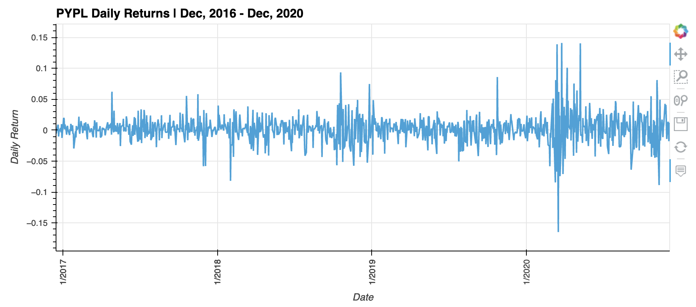
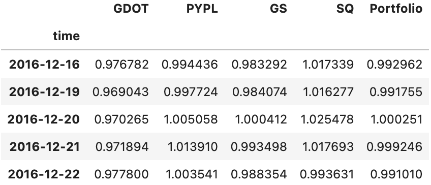
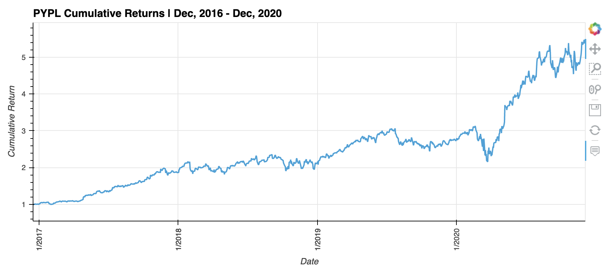
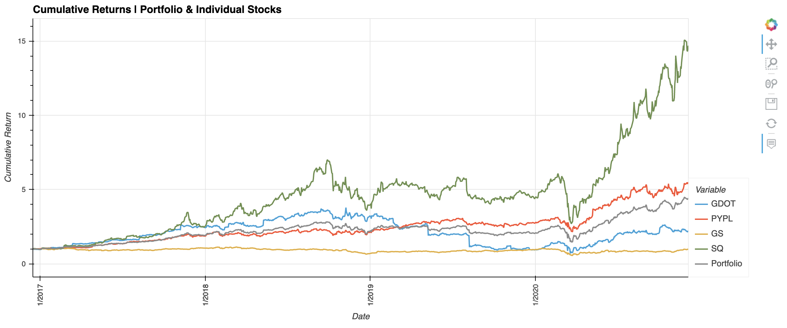

# ETF Analyzer

This analysis leverages a SQLite database to analyze the performance of four assets individually and combined as an equal-weight portfolio. [Voilà](https://voila.readthedocs.io/en/stable/index.html) is used on the local machine to present to non-technical users and allow them to manipulate the interactive charts. If the analysis carried out in Jupyter Notebook and displayed using Voilà meets the end-users needs it can be deployed using Heroku or a secured intranet.  


## Technologies

This project leverages python 3.7 with the following packages:

* [Numpy](https://numpy.org/) - For numerical operations  
* [Pandas](https://pandas.pydata.org/) - For analyzing and transforming data
* [SQLAlchemy](https://www.sqlalchemy.org/) - For interacting with SQL databases within Python
* [PyViz](https://pyviz.org/) - For visualizing data 
* [HoloViews](http://holoviews.org/) - For creating interactive plots
* [Voilà](https://voila.readthedocs.io/en/stable/index.html) - For abstracting code, presenting and interacting with Jupyter Notebooks via HTML


## Installation Guide

Before running the application first install the following dependencies.

```python
  pip install numpy
  pip install pandas
  pip install SQLAlchemy
  pip install pyviz
  pip install hvplot
  pip install voila
  pip install jupyterlab
```


## Usage

To use the ETF Analyzer clone the repository and run the following code in the same directory as the notebook, `etf_analyzer.ipynb`:

```python
voila etf_analyzer.ipynb
```

This will display a web page in the default browser that displays abstracts away the code in the notebook while displaying the markdown, code outputs, and interactive charts.

Below are several examples of tables and charts displayed when interacting with the notebook using Voilà:  
<br>

  
<br>

  
<br>

  
<br>




## Contributors

Josh Mischung: [josh@knoasis.io](josh@knoasis.io), [LinkedIn](https://www.linkedin.com/in/joshmischung/)


## License

MIT License

Copyright (c) [2022] [Joshua Mischung]

Permission is hereby granted, free of charge, to any person obtaining a copy
of this software and associated documentation files (the "Software"), to deal
in the Software without restriction, including without limitation the rights
to use, copy, modify, merge, publish, distribute, sublicense, and/or sell
copies of the Software, and to permit persons to whom the Software is
furnished to do so, subject to the following conditions:

The above copyright notice and this permission notice shall be included in all
copies or substantial portions of the Software.

THE SOFTWARE IS PROVIDED "AS IS", WITHOUT WARRANTY OF ANY KIND, EXPRESS OR
IMPLIED, INCLUDING BUT NOT LIMITED TO THE WARRANTIES OF MERCHANTABILITY,
FITNESS FOR A PARTICULAR PURPOSE AND NONINFRINGEMENT. IN NO EVENT SHALL THE
AUTHORS OR COPYRIGHT HOLDERS BE LIABLE FOR ANY CLAIM, DAMAGES OR OTHER
LIABILITY, WHETHER IN AN ACTION OF CONTRACT, TORT OR OTHERWISE, ARISING FROM,
OUT OF OR IN CONNECTION WITH THE SOFTWARE OR THE USE OR OTHER DEALINGS IN THE
SOFTWARE.
